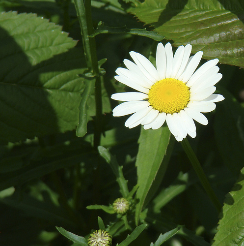
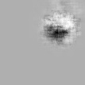

# Name
dnn_rf_sw - Visualize receptive field using slide-window(sw) occulding method for interested channels

# Synopsis
dnn_rf_sw -net Net -layer Layer -chn Channel -stim Stimulus -wsize WindowSize -stride Stride -metric Metric -out Output

# Arguments
## Required Arguments
|Argument|Discription|
|--------|-----------|
|net     |Name of a neural network|
|stim    |Path of a .stim.csv file which contains stimulus information|
|layer   |Name of the target layer.</br>Only support one layer each time.</br>E.g., 'conv1' represents the first convolution layer, and 'fc1' represents the first full connection layer.|
|chn     |Index of target channel.</br>Only support one channel each time.</br>Channel index starts from 1.|
|wsize     |Windows size of occluder.</br>Please enter two integers which define window's length and width.|
|stride    |Stride of occluder window.</br>Please enter two integers which define stride in x_axis and y_axis.|
|metric    |Metric to extract the unit's activation.</br>Only support max/mean/L1/L2.|
|out     |Output path to save the occluder image|

# Outputs
A series of occluder images based on your stimilus and interested net information

# Examples
```
dnn_rf_sw -net AlexNet -layer conv5 -chn 122 -stim ./flowers.stim.csv -wsize 11 11 -stride 2 2 -metric max -out ./image/rf_sw/
```
The original image used in this doc is displayed as below:
<center></center>

The receptive field occulding image is displayed as below:
<center></center>


