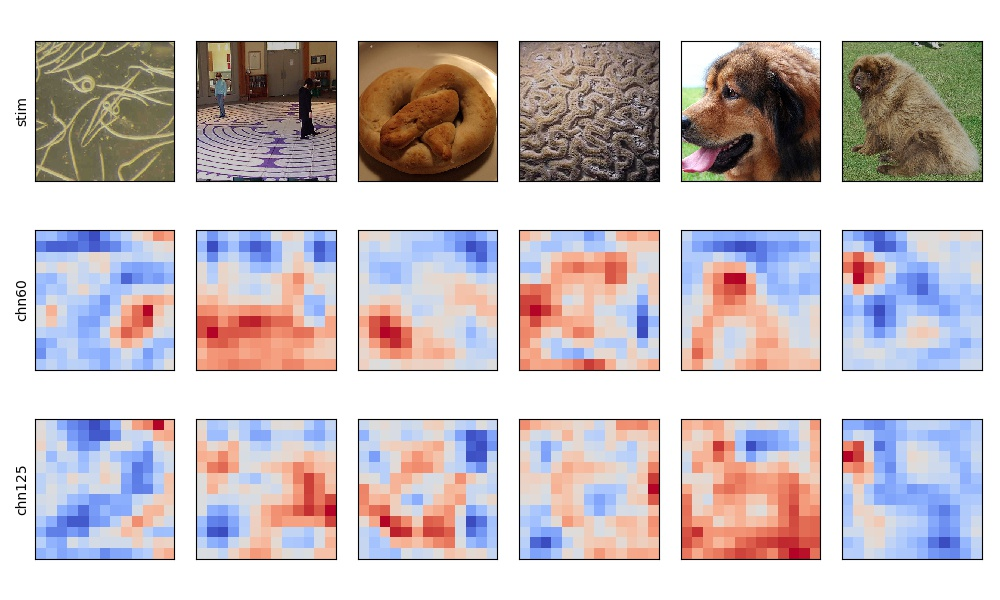

## Name
<b>dnn_view</b> - Visualize feature maps of stimuli.  

## Synopsis
dnn_view -net Net -layer Layer [Layer ...] -chn Channel [Channel ...] [-cmap Colormap] [-vmin Vmin] [-vmax Vmax] [-show] -out Output

## Arguments
### Required Arguments
|Argument|Discription|
|--------|-----------|
|net     |Name of DNN Model, which should be placed in $DNNBRAIN_DATA/models with format *.pth.|
|layer   |Convolution layers used to specify where activation is extracted from.</br>E.g., 'conv1' represents the first convolution layer</br>Only support convolution layer!|
|chn     |Channel numbers used to specify which channels are used to.</br>Channel index starts from 1.</br>Don't support view more than 5 channels at once!|
|stim    |A .stim.csv file which contains stimulus information|

### Optional Arguments
|Argument|Discription|
|--------|-----------|
|cmap    |Show feature maps with the specified colormap.</br>Default is 'colorwarm'.|
|vmin    |The minimal value used in colormap is applied in all feature maps.</br>Default is the minimal value of each feature map for itself.|
|vmax    |The maximal value used in colormap is applied in all feature maps.</br>Default is the maximal value of each feature map for itself.|
|show    |If used, display stimuli and feature maps in figures.|

## Outputs
A .jpg image visualizing the original stimulus and the feature maps of required net information.

## Examples
```
dnn_view -net AlexNet -layer conv5 -chn 60 125 -stim ./test.stim.csv -show -out ./dnn_view.act.h5
```
The output image is displayed as below:
<center></center>