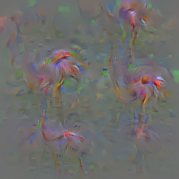

# Synthesize Optimal Image
There is an example to synthesize the image which can extract the highest activation of target unit.
In this example we will get optimal image of channel 131 in layer fc3, wich is resposible for flamingo category. 
There will be many detailed annotations in code.

## Code
```
#import 
import os
from os.path import join as pjoin
from dnnbrain.dnn.models import AlexNet
from dnnbrain.dnn.algo import SynthesisImage
from dnnbrain.dnn.base import ip

#0: Folds preparation
path = os.getcwd()

#1:Parameter Set
#1.1 prepare target channel
	#First save your target channel in variable
layer='fc3'
chn = 131
	# if you want to get many units 
	# you can make a dict for loop conviently


#1.2 method
	# Next you can choose metrics for synthesizing,
	# you must decide how to comptue the activation in 1.2.1
	# and for those in 1.2.2-1.2.4, they are optinal method
	# you can choose only one or combinitions of many
	# which depends on your purpose and image quality.

#1.2.1 How to compute
	# Because channels in convolutional layers has more 
	# than one activation value, we provide mean and max
	# to compute the activation loss function of activation  
	# map, but for fully-connected(fc) layers, the activation 
	# map only has one activation.
act_meth = 'mean'
 
#1.2.2 Regularization
	# Loss function =  - activation + regularization
	# where activation is the mean or max of the channel
	# and regularization comstraint additional requirement
	# on the image, usually dealing with outliers in pixels.
reg_meth = 'TV' # Method name:total variance
reg_lambda = 0.01 

#1.2.3 Image Precondition
	# This type of metrics process the whole image in every
	# iteration, often blur the image to mitigate high frequency.
pre_meth = 'GB' # Method name: guassian blur
GB_radius = 0.3

#1.2.4 Gradient Smooth
	# Gradient smooth works by smooth the gradient of activation,
	# gradient determines the output of image in every iteration. 
sm_meth = 'Fourier' #Method name: Fourier filter
factor = 0.3


#1.3 utiliz
	# If you want to see interim images in iteration, 
	# or you want to know how loss function value changes
	# we provide method for such prpose
	
#1.3.1 Save interval images in iteration 
save_out_interval=True
save_interval = 10 # every 10 iteration save one
	# Such method can helo you know the evolution of 
	# optimal image.
	
#1.3.2 Print when iterating
print_inter_loss=True
step = 10 # print loss every 10 iterations

# Above are paremeters available of SynthesisImage
# following we will use some parameters to synthesize
# the optimal image for fc3 131. Specifically, we
# will use Total Variance.


#2: Synthesize

#Get Network
dnn = AlexNet()

#prepare parameters of optimizer
lr = 0.1 #learning rate
n_iter = 500 # number of iterations

#create instance of SynthesisImage
synthesis = SynthesisImage(dnn)

#Set layer & channnel
synthesis.set_layer(layer,chn)

#Set metric parameters
	# Note if you don't use some optinal ones, 
	# you need to give 'None' value,
	# here we only adopt smooth_metric
	# but all the metrics should be set
synthesis.set_metric(activ_metric='mean',regular_metric=reg_meth,
                   precondition_metric=None, smooth_metric=None)

#Set utiliz parameters
	# Here we set both to be True,
	# then essential parameters should be set 
	# in sythesize()
synthesis.set_utiliz(save_out_interval,print_inter_loss)

#start sythesize
optimal_img = synthesis.synthesize(init_image=None,unit=None,lr=lr,regular_lambda = reg_lambda,
									n_iter = n_iter, save_path = path,save_interval = save_interval,
									GB_radius = GB_radius, factor = factor, step = step)
	# you can omit init_image & unit & factor & GB_radius if not necessary

# Save final images
# name the image path
file_name = f'optimal_{layer}_chn{chn}.png'
file_path = pjoin(path,file_name)
# transfer to Image
img_out = ip.to_pil(optimal_img,True)
# save in the current dir
img_out.save(file_path)
# you will see the png in your current path

```
The optimal image of flamingo is displayed as below:
<center></center>
Note: usually combinitions pf metrics will produce much better quality, but more parameters should be searched.
